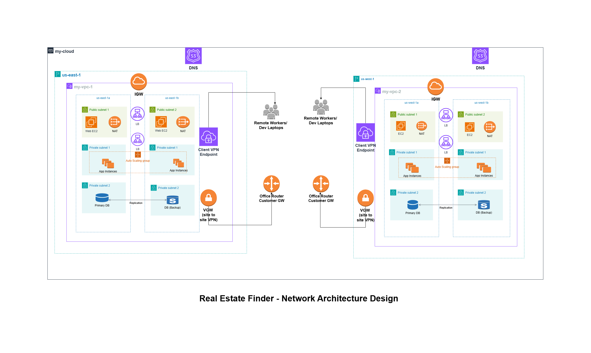
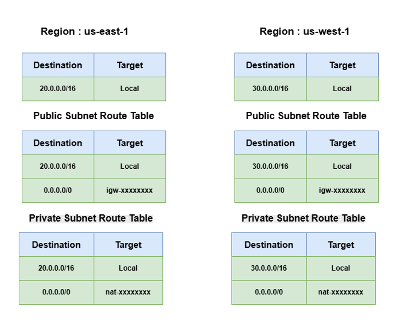

# Real Estate Finder - Network Architecture

A network architecture for a platform that will serve as a real estate finder. People will come and search for houses, bid on them, chat with the buyer/seller. The platform will fetch data from many 3rd party services for different countries and cities.

---
## Table of Contents

- [Chapter 1: Assumptions](#chapter-1-assumptions)
- [Chapter 2: Project Details](#chapter-2-project-details)
- [Chapter 3: Architecture Decisions](#chapter-3-architecture-decisions)
- [Chapter 4: Reasoning and Networking Components](#chapter-4-reasoning-and-networking-components)
- [Chapter 5: Use Cases](#chapter-5-use-cases)

---

## Chapter 1: Assumptions

### 1. High availability is mandatory
The platform must survive the failure of a single Availability Zone or even an entire Region.

### 2. A secondary Region is required for failover
If Region A goes down, Region B must take over with minimal downtime.

### 3. Applications require separation of concerns
Web tier must stay public and app tier must be private for security and compliance.

### 5. Databases require both local HA and cross-region failover
Hence: primary + standby (same region) and replication across regions.

### 6. Outbound internet access from private subnets must be controlled
NAT Gateways in public subnets serve this purpose.

### 7. On-premise offices must connect securely
This requires both:

Client-to-Site VPN for developers/ remote workers

Site-to-Site VPN for the office router

### 8. The platform must be reachable via a custom domain name
Route 53 manages DNS in both Regions.

### 9. Autoscaling is required for unpredictable traffic patterns
Load balancers must distribute traffic across EC2 instances automatically.

### 10. Security boundaries must be strict
Public resources are only for load balancing and NAT and everything else stays in private subnets.

## Chapter 2: Project Details

Here I have designed a network architecture for a platform that will serve as a real estate finder.

The real-estate platform lets users search properties, bid on listings, and chat with buyers and sellers. The system also pulls external data from multiple third-party services (property data, maps, taxation, regional data APIs).

The network must serve traffic from multiple countries, maintain low latency, and offer High Availability across two AWS regions, each with two Availability Zones.

Developers should be able to securely access internal services, databases, and integration endpoints through VPN without exposing internal resources publicly. Security, scalability, and clean separation between public and private layers are mandatory.

## Chapter 3: Architecture Decisions

#### 1. Why multi regions and availability zones

#### 2. Why public subnets for Web APP

#### 3. Why private subnets for APP/DB

#### 4. Why NAT vs Direct Internet

#### 5. Why Load Balancer 

#### 6. Why client-to-site and server-to-site vpn needed

## Chapter 4: Reasoning and Networking Components
- VPC per region
- 2 Regions & 2 Availabity Zones
- 1 public subnet & 2 private subnets in each AZ
- 2 Load Balancer(LB) for auto scaling in each reigion
- 1 primary DB and 1 stand-by (backup) DB for replication in each egion
- Web EC2 instances (resides in public subnet)
- App EC2 instances (resides in private subnet)
- NAT (resides in public subnet)
- Internet Gateway in each reigion
- Route 53 (DNS) in each region
- Client - to - Site VPN in each region
- Site - to - Site VPN in each region
- Office router (customer GW) in each region
  
## Chapter 5: Use Cases
- #### VPC   
   Used to create a logically isolated, secure virtual network within the cloud for launching AWS resources

- #### Route 53 (DNS)
   Used for its highly available and scalable Domain Name System (DNS) service, which translates domain names into IP addresses, registers domains, and routes internet traffic to applications.

- #### Regions
  Used for disaster recovery, global reach, or regulatory compliance.
    
- #### Availabity Zones
  Used multiple AZs (within one region) for high availability and low-latency failover.

- #### Public Subnets
  Subnet is by default private but when we add internet gateway it becomes public. Kept web server, NAT, LB's in public subnet so that it can directly talk to the internet using IGW. 
- #### Private Subnets
  Used to protect backend services from direct internet access and reduces malacious attacks. Kept app server and DB's in private subnets. Instances in private subnets can not talk to each other. But it can be possible using NAT. NAT can talk to internet on behalf of these EC2 instances. EC2 will send traffic to the NAT. NAT will route traffic to the internet, will take the traffic back and send the packet to the EC2 instances.

- #### Load Balancers(LB)
  Used LB to give application a single public entry point, distribute traffic across multiple servers, remove unhealthy instances automatically, and keep the system online even if a server or availability zone fails.

- #### Primary DB and stand-by (backup) DB
  Used primary DB to handle all live reads and writes. And standby DB is a synced replica that stays ready to take over if the primary fails. This setup keeps the database available during outages and prevents data loss.

- #### Web Server EC2 instances
  Used to deploy web app EC2 instances in public subnet. 
- #### App Server EC2 instances
  Used to deploy app EC2 instances in private subnet.
- #### NAT
  Used for private subnets make outbound internet calls.
- #### Internet Gateway
  Used so that it allows public subnets to reach the internet.
- #### Client - to - Site VPN
  Secure access for developers.

- #### Site - to - Site VPN
  Used for internal communication on premise data centers, office networks to aws vpc. 

- #### Office router (customer GW)
  Resides in the on premise data centers/office netwroks to communicate with the aws vpc.
